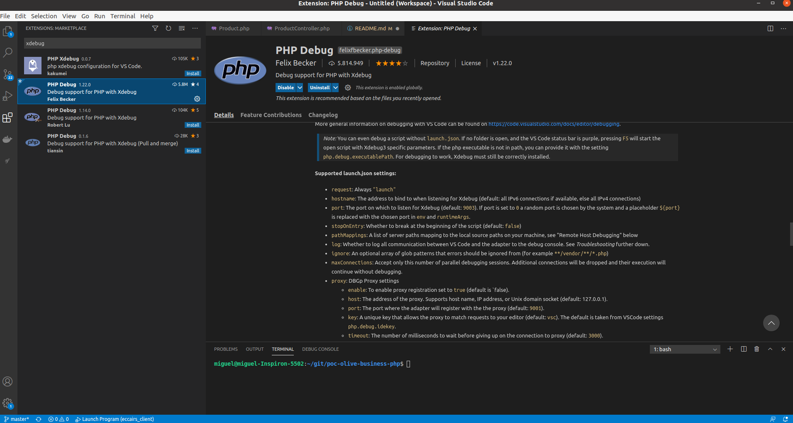
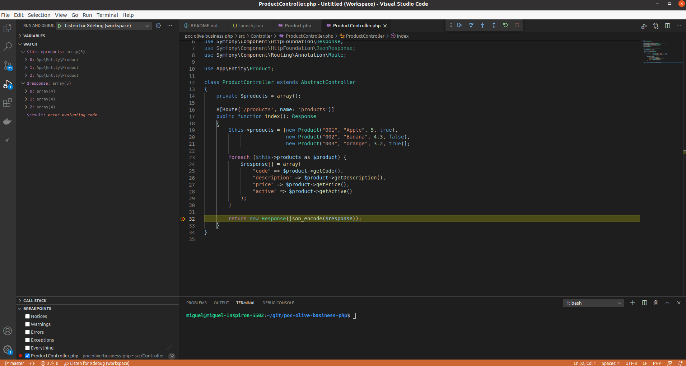

# Description
Poc Keycloak Business PHP Symfony Microservice

## Prepare environment
- Install php 8.1

```shell
sudo add-apt-repository ppa:ondrej/php
sudo apt update
sudo apt install php8.1

php -v
```
- Install some php 8.1 extensions

```shell
sudo apt install php8.1-{bcmath,xml,fpm,mysql,zip,intl,ldap,gd,cli,bz2,curl,mbstring,pgsql,opcache,soap,cgi}

php -m
```

- Install php_cli (Server side PHP interpreter)

```shell
sudo apt install php-cli
```

- Install composer (PHP dependency manager)

```shell
curl -sS https://getcomposer.org/installer -o composer-setup.php
sudo php composer-setup.php --install-dir=/usr/local/bin --filename=composer

composer -v
```

- Install Symfony CLI

```shell
sudo apt install php php-json php-ctype php-curl php-mbstring php-xml php-zip php-tokenizer php-tokenizer libpcre3 --no-install-recommends

wget https://get.symfony.com/cli/installer -O - | bash

```

configure .bashrc add this:

```shell
export PATH="$HOME/.symfony/bin:$PATH"

symfony -v
```

## Debug Project from Visual Code

- Install Xdebug in ubuntu

```shell
sudo apt-get install php8.1-xdebug
```

- Configure XDebug. Add in /etc/php/8.1/cli/php.ini this configuration

```shell
[xdebug]
xdebug.mode = debug
xdebug.start_with_request = yes
```

## Configure Visual Code UI

Install some Visual code Extension to develope and debug with symfony module

- PHP Intelephense
- PHP Debug



## Create Project and dependencies. We must installed symfony 5.x beacuse the keycloak bundle adapter is compatible with this version

symfony new poc-olive-business-php -version=5.3

## Start and debug project from shell terminal

```shell
symfony server:start
```

- Start XDebug from Visual code. 

Create a launch.json for the project from Visual Code Debug tab. This will create three configurations. Set default debug port to 9003

```javascript
{
    // Use IntelliSense to learn about possible attributes.
    // Hover to view descriptions of existing attributes.
    // For more information, visit: https://go.microsoft.com/fwlink/?linkid=830387
    "version": "0.2.0",
    "configurations": [
        {
            "name": "Listen for Xdebug",
            "type": "php",
            "request": "launch",
            "port": 9003
        },
        {
            "name": "Launch currently open script",
            "type": "php",
            "request": "launch",
            "program": "${file}",
            "cwd": "${fileDirname}",
            "port": 0,
            "runtimeArgs": [
                "-dxdebug.start_with_request=yes"
            ],
            "env": {
                "XDEBUG_MODE": "debug,develop",
                "XDEBUG_CONFIG": "client_port=${port}"
            }
        },
        {
            "name": "Launch Built-in web server",
            "type": "php",
            "request": "launch",
            "runtimeArgs": [
                "-dxdebug.mode=debug",
                "-dxdebug.start_with_request=yes",
                "-S",
                "localhost:0"
            ],
            "program": "",
            "cwd": "${workspaceRoot}",
            "port": 9003,
            "serverReadyAction": {
                "pattern": "Development Server \\(http://localhost:([0-9]+)\\) started",
                "uriFormat": "http://localhost:%s",
                "action": "openExternally"
            }
        }
    ]
}
```

Select "Listen for Xdebug" configuration from previous list and start it. Set any breakpoint in your code and debug




## Install development dependencies 

Install symfony maker bundle to create entities, repositories and controllers

```shell
composer require --dev symfony/maker-bundle
```

## Install runtime dependencies 

Install symfony orm pack bundle dependencies to create repositories for datasources. This dependency installed Doctrine dependency indirectly.

```shell
composer require symfony/orm-pack
```

## Install keycloak runtime dependency

This Symfony  bundle adapter integrate keycloak with symfony security

```shell
composer require abel/keycloak-bearer-only-adapter-bundle
```

If obtaine error during installation create adapter configuration manually in your symfony project. Create this file name **abel_keycloak_bearer_only_adapter.yaml** under config/packages folder and add this configuration

```shell
abel_keycloak_bearer_only_adapter:
    issuer: '%env(OAUTH_KEYCLOAK_ISSUER)%'
    realm: '%env(OAUTH_KEYCLOAK_REALM)%'
    client_id: '%env(OAUTH_KEYCLOAK_CLIENT_ID)%'
    client_secret: '%env(OAUTH_KEYCLOAK_CLIENT_SECRET)%'
```

The environment variables will be added in the env file in your symfony project with the data from your keycloak service

```shell
###> Keycloak ###
OAUTH_KEYCLOAK_ISSUER=http://localhost:8080/auth
OAUTH_KEYCLOAK_REALM=poc
OAUTH_KEYCLOAK_CLIENT_ID=business-api-php
OAUTH_KEYCLOAK_CLIENT_SECRET=df1c0d80-5c8a-49c3-9293-92279b12a152
###< Keycloak ###
```

## Create Entities, Repositories or Controllers for your mock domain model

Create a Product entity

```shell
php bin/console make:entity
```

Create a ProductController

```shell
php bin/console make:controller
```

We are not going to implement any mock repository connection in this PoC